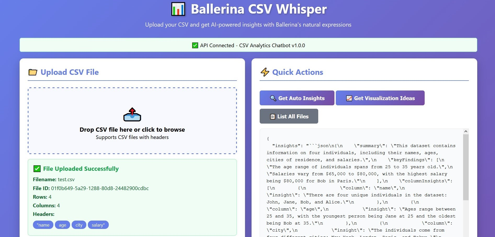
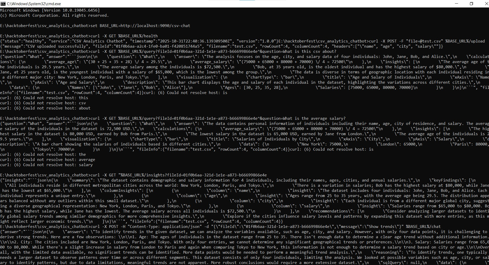

# Ballerina Data Whisper Agent

A CSV Analyzing Agentic AI Platform built with Ballerina and OpenAI

## The Problem: Data Analysis Shouldn't Require a PhD

We've all been there. You have a CSV file sitting on your desktop, filled with valuable data. You know there are insights hidden in those rows and columns, but extracting them means:

- Opening Excel and wrestling with pivot tables
- Writing Python scripts with pandas
- Learning SQL queries
- Or worse — manually scrolling through hundreds of rows

### What if you could just ask your data questions?

What if instead of `SELECT AVG(salary) FROM employees WHERE department = 'Engineering'`, you could simply ask: **"What's the average salary in Engineering?"**

That's exactly what I built. Meet **Ballerina Data Whisper** — your AI-powered CSV analyst that speaks human.

---

## Quick Start: Playing with UI



### 1. Clone the repository

```bash
git clone https://github.com/JayanaGunaweera01/data-whisper.git
```

### 2. Configure your OpenAI API key

Replace your OpenAI key in `Config.toml`:

```toml
openaiApiKey = "sk-..."
```

### 3. Install Ballerina

Install Ballerina 2201.13.0-m3 (Swan Lake) or greater using the `bal dist pull` command:

```bash
bal dist pull 2201.13.0-m3
```

### 4. Start the Ballerina service

From the project root, open a new terminal and run:

```bash
bal run --experimental
```

### 5. Start the frontend server

Navigate to the `frontend` folder and start another terminal:

```bash
cd frontend
python -m http.server 8080
```

### 6. Access the application

Open your browser and navigate to:

```
http://localhost:8080
```

---

## Quick Start: Playing with Terminal



### Prerequisites

Complete steps 1-4 from the **Playing with UI** section above.

### Setup

Start a terminal from the project root and set the base URL:

```bash
set BASE_URL=http://localhost:9090/csv-chat
```

### API Commands

#### 1. Health Check

```bash
curl -X GET %BASE_URL%/health
```

#### 2. Upload CSV File

Example with `test.csv`:

```bash
curl -X POST -F "file=@test.csv" %BASE_URL%/upload
```

#### 3. Get File ID

You can extract the file ID from the upload response:

```bash
curl -s -X POST -F "file=@test.csv" %BASE_URL%/upload | findstr "fileId"
```

#### 4. Ask Questions

Replace `YOUR_FILE_ID` with your actual file ID:

```bash
curl -X GET "%BASE_URL%/query?fileId=YOUR_FILE_ID&question=What is this csv about?"
```

**Example:**
```bash
curl -X GET "%BASE_URL%/query?fileId=01f0b6aa-321d-1e1e-a873-b66699866e4e&question=What is this csv about?"
```

#### 5. Get Insights

Replace `YOUR_FILE_ID` with your actual file ID:

```bash
curl -X GET "%BASE_URL%/insights?fileId=YOUR_FILE_ID"
```

#### 6. Chat with Your Data

Replace `YOUR_FILE_ID` with your actual file ID:

```bash
curl -X POST -H "Content-Type: application/json" -d "{\"fileId\":\"YOUR_FILE_ID\",\"message\":\"Show trends of salary in this csv\"}" %BASE_URL%/chat
```

---

## Resources

- **Medium Article:** [https://medium.com/@Jayana_Gunaweera/ballerina-csv-whisper-agent-%EF%B8%8F-6f89f357083b]
- **YouTube Demo:** [https://youtu.be/SVVQGRZKgWY]

---

